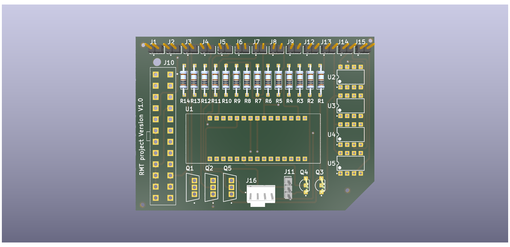
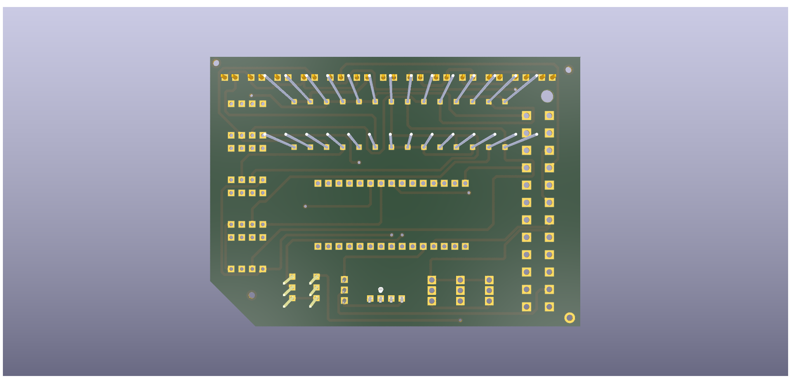

<div align="center">



# ⚡ PRJ-PCB-1006-2023-RMT

### 14-Channel Interface Board for STM32 Nucleo-32

**Designed by [Hibrar Ahmad](https://github.com/hiibrarahmad)**

[](#)
[](#)
[](#)

[](../../commits/main)
[](https://hiibrarahmad.github.io/PRJ-PCB-1006-2023-RMT.github.io/)

<br/>

[🔬 Interactive PCB View](https://hiibrarahmad.github.io/PRJ-PCB-1006-2023-RMT.github.io/) · [📦 3D Model (STEP)](assets/RMT.step)

</div>

---

## 📖 Project Overview

> [!NOTE]
> This was the designer's **first PCB, originally designed in Altium in early 2024** (internal ECO logs date to February 2024; recalled by the designer as "my first PCB from 2023"). The exact intended end-application isn't fully documented — this overview is reconstructed from the board's own silkscreen text and its real bill of materials, not from memory.

The board's silkscreen reads **"RMT project Version V1.0"** — that's the only explicit project name that exists for it. Based on the actual BOM and layout:

- Designed to interface with an **STM32 Nucleo-32 (STM32L432KC)** development board
- Breaks out **14 channels**, each with a matched 1.07 kΩ resistor, to individual headers (J1–J9, J12–J15)
- A **24-position, 4.2mm-pitch power connector** (J10) for high-current external wiring
- A single **AUIRFZ44N power MOSFET** (55V, TO-220) plus an **NPN driver transistor** — a switching output stage
- A **dual op-amp** (8-pin PDIP) — likely signal conditioning or comparator duty
- Best read as a **multi-channel driver/interface shield** — most likely for switching or sensing across several external channels (e.g. relay, LED, or sensor-array driving). Flagged here rather than asserted with more confidence than the evidence supports.

---

## 🖼️ PCB Preview

<table>
<tr>
<td align="center" width="50%">

**🔝 Top Side**


</td>
<td align="center" width="50%">

**🔻 Bottom Side**



</td>
</tr>
</table>

🔗 **[→ View Interactive PCB Online](https://hiibrarahmad.github.io/PRJ-PCB-1006-2023-RMT.github.io/)**

---

## 📋 Key Components (from the real BOM)

| Reference | Part | Function |
|-----------|------|----------|
| Power switch | **AUIRFZ44N** (TO-220, 55V) | N-Channel Power MOSFET — switching output stage |
| Driver | NPN Silicon Transistor (TO-92) | Gate/base drive for the switching stage |
| Signal conditioning | Dual Operational Amplifier (8-pin PDIP) | Amplification / comparator |
| R1–R14 | 1.07 kΩ ±1%, 1/4W | 14 matched channel resistors |
| J10 | 24-position, 4.2mm pitch power connector | High-current external harness |
| J1–J9, J12–J15 | 2-pin headers | Per-channel I/O |
| — | STM32 Nucleo-32 (STM32L432KC) | Target MCU board (Arduino-compatible headers) |

---

## 📁 Repository Structure

```
PRJ-PCB-1006-2023-RMT.github.io/
│
├── assets/
│   ├── RMT-TOP.png    ← Top view render (PNG)
│   ├── RMT-BOT.png    ← Bottom view render (PNG)
│   └── RMT.step        ← Real 3D model (STEP export)
│
├── index.html           ← Interactive PCB/BOM viewer
└── README.md            ← This file
```

---

## 🔗 Links

| Resource | URL |
|----------|-----|
| 🌐 Interactive PCB View | [hiibrarahmad.github.io/PRJ-PCB-1006-2023-RMT.github.io](https://hiibrarahmad.github.io/PRJ-PCB-1006-2023-RMT.github.io/) |
| 👤 Designer | [github.com/hiibrarahmad](https://github.com/hiibrarahmad) |

---

<div align="center">

**PRJ-PCB-1006-2023-RMT**

*14-Channel STM32 Nucleo-32 Interface Board · Designed by Hibrar Ahmad*

© 2026 hiibrarahmad. All Rights Reserved.

</div>
